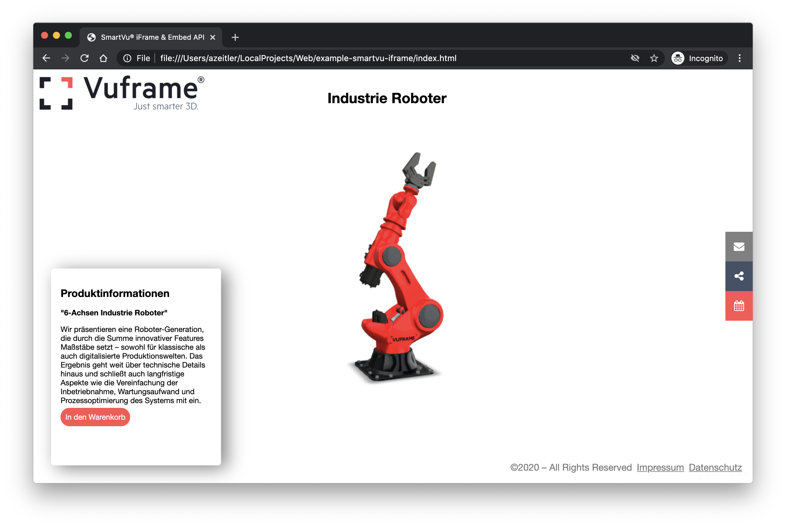

# SmartVu® iFrame & Embed API Example

This is a sample site that shows how to interact with the web-version of a SmartVu® via the Embed API.

Please note: the HTML and JS is boilerplate only and does not adhere to best practices.
We're using vanilla JS with some jQuery for simplicity.

The core logic is implemented in `robot-configurator.js`.

Try it out:

https://vuframe.github.io/example-smartvu-configurator/

## Docs

https://vuframe.com/docs/platform/smartvu/iframe#embed-api

## Contact

Rodrigo Angstrom – rodrigo.angstrom@vuframe.com

